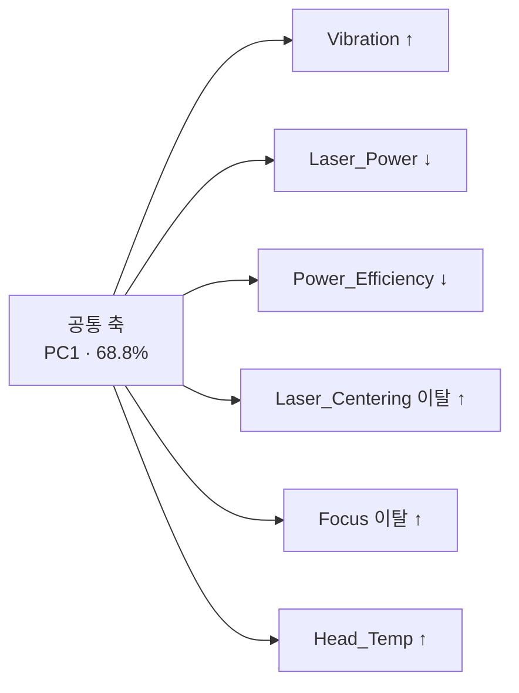

# Goal 3 — Vibration의 인자 간 얽힘 구조 (daeho)

## 세 줄 요약

1. **원본에서 Vibration은 어떤 인자와도 얽혀 있지 않습니다.** 31개 설비인자 전부 |r| < 0.07, VIF 1.01, 상호작용 0건. 홀로 움직이는 독립 인자입니다.
2. **R1에서는 5개 인자와 한 덩어리로 움직입니다.** `Power_Efficiency`(−0.74) `Laser_Power`(−0.73) `Laser_Centering_Position`(+0.66) `Focus`(+0.59) `Head_Temp`(+0.58). 주성분 하나가 이 6개의 **68.8%** 를 설명합니다.
3. **두 데이터는 모순되지 않습니다.** 얽힘이 강한 6개 인자의 **상관 부호가 6/6 일치**하고, Vibration의 불량 영향 방향도 전부 일치합니다. 원본에 미약하게 있던 경향이 R1에서 10배 이상 증폭된 구조입니다.

바쁘시면 [`01_corr_fdc.csv`](./01_corr_fdc.csv) 하나만 보셔도 됩니다. 원본과 R1의 상관계수가 나란히 있습니다.

---

## 통계 몰라도 되는 설명

### 무엇을 봤나

Goal 2에서 `Vibration`이 Particle의 원인 인자로 확정됐습니다. 그런데 인자 하나를 잡으려면
**그게 정말 혼자 움직이는지**를 알아야 합니다. 진동이 높을 때 레이저 파워도 같이 떨어지고
있다면, "진동을 잡자"는 조치가 사실은 다른 걸 잡는 것일 수 있으니까요.

그래서 **Vibration이 나머지 인자들과 같이 움직이는지**를 원본과 R1 각각에서 확인하고,
**원본에서 본 것이 R1에서도 그대로 나오는지** 검증했습니다.

### 얽힘에는 두 종류가 있습니다

| | 수준 얽힘 | 효과 얽힘 |
|---|---|---|
| 질문 | 진동이 높을 때 **다른 인자도 같이** 변하나? | 진동의 **위험도**가 다른 인자 값에 따라 달라지나? |
| 문제되는 것 | 인자 **선정**이 흔들림 | 관리 **기준값**을 조건별로 나눠야 함 |

둘 다 봤습니다.

### 숫자 읽는 법

| 지표 | 무엇을 재나 | 기준 |
|---|---|---|
| **상관 \|r\|** | 두 인자가 같이 움직이는 정도 | 0.3 이상이면 "얽혔다" |
| **VIF** | 이 인자를 나머지 전부로 얼마나 예측 가능한가 | **1 = 완전 독립**, 5 초과 주의, 10 초과 심각 |
| **PC1 설명력** | 여러 인자를 관통하는 공통 축이 있는가 | 6개 인자가 무관하면 약 **17%**(=1/6) |

---

# 1부 — 원본 데이터

**n = 100,000 · Vibration 평균 0.1558 (표준편차 0.0215)**

## 수준 얽힘 — 없습니다

| 인자 | r |
|---|---|
| CLN_Flow | −0.063 |
| Focus | +0.053 |
| Head_Temp | +0.052 |
| Laser_Power | −0.052 |
| Power_Efficiency | −0.041 |
| (그 외 26개) | \|r\| < 0.02 |

**|r| ≥ 0.3 인 인자가 0개**입니다. 가장 큰 게 CLN_Flow의 −0.063입니다.

- **VIF** — 전 인자 **1.01**. 5를 넘는 게 하나도 없습니다. 완벽한 독립입니다.
- **PC1 설명력 19.1%** — 무작위 수준(17%)과 거의 같습니다. 공통 축이 없다는 뜻입니다.

## Response와의 관계 — Surface_Roughness 하나뿐

| Response | r |
|---|---|
| **Surface_Roughness** | **+0.329** |
| Bottom_Kerf | +0.054 |
| Top_Kerf | +0.051 |
| Kerf_Width_Profile | +0.046 |

13개 응답 중 |r| ≥ 0.3 인 것은 **Surface_Roughness 하나**입니다. Goal 2에서 "Surface_Roughness는
Vibration의 결과이지 원인이 아니다"라고 판정한 것과 일관됩니다.

## 효과 얽힘 — 없습니다

| 불량 | 불량군 / 정상군 | Vibration OR | 유의한 상호작용 |
|---|---|---|---|
| Particle | 6,455 / 90,783 | 1.482 [1.44–1.52] | **0 / 31** |
| Micro_Crack | 34 / 90,783 | 1.231 [0.88–1.72] | **0 / 31** |
| Chipping | 4건 | 표본 부족 | 판정 불가 |

> **1부 결론**: 원본에서 Vibration은 **완전한 독립 인자**입니다. 다른 인자와 같이 움직이지도 않고,
> 다른 인자에 따라 위험도가 달라지지도 않습니다. 그래서 "진동만 잡는 조치"가 성립합니다.

---

# 2부 — R1 데이터

**n = 100,000 · Vibration 평균 0.1749 (표준편차 0.0382 — 원본의 1.8배)**

## 수준 얽힘 — 6개 인자와 강하게 얽혀 있습니다

| 인자 | r |
|---|---|
| **Power_Efficiency** | **−0.744** |
| **Laser_Power** | **−0.727** |
| **Laser_Centering_Position** | **+0.663** |
| **Focus** | **+0.588** |
| **Head_Temp** | **+0.584** |
| **Cooling_Flow** | **−0.320** |
| CLN_Flow | −0.061 |
| (그 외 24개) | \|r\| < 0.01 |

**|r| ≥ 0.3 이 6개**입니다. 원본은 0개였습니다.

읽는 법: **진동이 높은 strip일수록 레이저 파워가 낮고, 효율이 떨어지고, 빔 정렬이 틀어져 있고,
포커스가 벗어나 있고, 헤드 온도가 높습니다.**

- **VIF** — 최대 **12.77**(Power_Efficiency), 5 초과가 **5개**. Vibration 자신은 3.43입니다.
- **PC1 설명력 68.8%** — 원본 19.1%와 완전히 다릅니다.

## 이 6개는 사실 축 하나입니다

PC1 적재량입니다.

| Vibration | Laser_Power | Power_Efficiency | Laser_Centering | Focus | Head_Temp |
|---|---|---|---|---|---|
| −0.43 | +0.45 | +0.45 | −0.41 | −0.35 | −0.35 |

부호를 뒤집어 읽으면, **축 하나가 움직일 때 6개가 동시에 이렇게 변합니다.**



설비가 열화될 때 나타나는 전형적인 동반 변화로 보입니다. **6개 센서가 각각 다른 원인을
보는 게 아니라, 하나의 상태를 6가지 방식으로 보고 있는** 구조입니다.

## Response와의 관계 — 전방위로 확대

| Response | r | 의미 |
|---|---|---|
| Bottom_Kerf | +0.797 | 커프 넓어짐 |
| Top_Kerf | +0.793 | 커프 넓어짐 |
| Kerf_Width_Profile | +0.792 | 커프 넓어짐 |
| Cutting_Offset | +0.650 | 절단 위치 틀어짐 |
| Groove_Depth | −0.633 | 홈 얕아짐 |
| Package_Size_1 | −0.594 | 치수 변동 |
| Surface_Roughness | +0.527 | 표면 거칠어짐 |

13개 중 **11개**가 |r| ≥ 0.3 입니다(원본은 1개). 진동이 크면 칼날이 흔들리니 커프가 넓어지고
홈이 얕아진다 — 물리적으로 앞뒤가 맞습니다.

## 효과 얽힘 — 불량마다 다릅니다

| 불량 | 불량군 / 정상군 | Vibration OR | 유의한 상호작용 | 상대 인자 |
|---|---|---|---|---|
| Chipping | 24,171 / 58,890 | **18.863** [18.12–19.63] | **7 / 31** | Power_Efficiency, Head_Temp, Focus, Laser_Power |
| Particle | 4,841 / 58,890 | 1.642 [1.60–1.69] | **0 / 31** | — |
| Micro_Crack | 4,887 / 58,890 | 1.458 [1.42–1.50] | **1 / 31** | Frequency |

**Particle은 R1에서도 상호작용이 0건입니다.** 진동의 위험도가 다른 인자에 좌우되지 않습니다.

**Chipping의 상호작용 7개는 상대가 전부 위 열화축 멤버입니다.** 진짜 상호작용이라기보다
공선성(VIF 12.77) 때문에 생긴 허상일 가능성이 큽니다. 별도 검증이 필요합니다.

> **2부 결론**: R1에서 Vibration은 독립 인자가 아니라 **6개 인자가 함께 움직이는 축의 일부**입니다.
> 다만 **Particle에 한해서는 여전히 상호작용이 없어** 단독 관리가 가능합니다.

---

# 3부 — 원본 결과가 R1에서 재현되는가

## (A) 얽힘 구조 — 강도는 달라졌지만 방향은 같습니다

| 지표 | 원본 | R1 |
|---|---|---|
| \|r\| ≥ 0.3 인자 수 | **0개** | **6개** |
| PC1 설명력 | 19.1% | **68.8%** |
| VIF > 5 인자 수 | **0개** | **5개** |

숫자만 보면 완전히 다릅니다. **그런데 부호를 보면 얘기가 달라집니다.**

| 인자 | 원본 r | R1 r | 부호 |
|---|---|---|---|
| Power_Efficiency | −0.041 | −0.744 | ○ |
| Laser_Power | −0.052 | −0.727 | ○ |
| Laser_Centering_Position | +0.007 | +0.663 | ○ |
| Focus | +0.053 | +0.588 | ○ |
| Head_Temp | +0.052 | +0.584 | ○ |
| Cooling_Flow | −0.012 | −0.320 | ○ |

**얽힘이 강한 6개 인자의 부호가 6/6 전부 일치합니다.**

원본에서 −0.041, R1에서 −0.744 — 크기는 18배 차이지만 **방향은 같습니다.**
즉 **원본에도 같은 경향이 미약하게 있었고, R1에서 증폭된 것**입니다. 두 데이터가 서로
반대되는 얘기를 하는 게 아닙니다.

> 전체 31개로 보면 20개가 일치합니다. 어긋난 11개는 `Vision_Exposure`(0.000 → −0.007) 같은
> 것들로, **양쪽 모두 |r| < 0.007** 인 잡음 구간입니다. 방향을 논할 크기가 아닙니다.

## (B) Vibration 효과 방향 — 전부 일치

| 불량 | 원본 OR (불량 건수) | R1 OR (불량 건수) | 판정 |
|---|---|---|---|
| Particle | 1.482 (6,455) | 1.642 (4,841) | **방향 일치** |
| Micro_Crack | 1.231 (34) | 1.458 (4,887) | **방향 일치** |
| Chipping | 판정 불가 (4) | 18.863 (24,171) | 원본 표본 부족 |

**방향이 어긋난 항목은 없습니다.** 진동이 높을수록 위험하다는 결론은 양쪽에서 같고,
R1에서 오히려 더 강하게 나옵니다.

## (C) 효과 얽힘 — Particle은 양쪽 다 0건

| 불량 | 원본 | R1 | 공통 |
|---|---|---|---|
| **Particle** | **0개** | **0개** | — |
| Micro_Crack | 0개 | 1개 (Frequency) | 0개 |
| Chipping | 판정 불가 | 7개 | — |

**Particle에서 Vibration이 다른 인자와 효과 얽힘을 갖지 않는다는 결론은 양쪽에서 재현됩니다.**

## 재현성 종합

| 항목 | 판정 |
|---|---|
| 얽힘 6개 인자의 **상관 부호** | ✅ **6/6 일치** |
| Vibration 효과 **방향** | ✅ **전부 일치** (불일치 0건) |
| Particle의 **효과 얽힘 없음** | ✅ **양쪽 0건** |
| 얽힘 **강도** | ⚠️ R1이 10~18배 강함 |
| \|r\| ≥ 0.3 인자 수 | ❌ 0개 → 6개 |

---

# 그래서 무엇을 해야 하나

## Vibration을 인자로 쓸 때

1. **Particle에 대해서는 Vibration 단독 관리가 성립합니다.** 원본에서 완전 독립이었고,
   R1에서도 **효과 얽힘이 0건**입니다. Goal 2의 결론(조치 가능한 원인 인자)을 그대로 유지해도 됩니다.

2. **Chipping·Micro_Crack에 대해서는 다릅니다.** R1에서 Vibration이 6개 인자와 한 덩어리로
   움직이고, Chipping은 상호작용도 7건 나옵니다. **"진동만 낮춘다"는 조치가 성립하지 않을 수
   있습니다.** 6개를 묶어 **설비 열화 상태**로 보고 조치를 설계하는 게 맞습니다.

## 인자를 뽑을 때 (R1 기준)

3. **`Vibration` `Laser_Power` `Power_Efficiency` `Laser_Centering_Position` `Focus` `Head_Temp`를
   개별 인자로 세지 않습니다.** 같은 축의 6가지 표현이라 6번 세는 셈이 됩니다.
   하나로 묶거나 대표 1개만 씁니다. 대표로는 **Vibration이 적절합니다** — VIF가 3.43으로
   가장 낮고, 물리적으로 원인 쪽입니다.

4. **전체 인자를 한꺼번에 넣은 SHAP이나 회귀계수만으로 판정하지 않습니다.** VIF 12.77이면
   기여도가 6개 사이에서 임의로 배분됩니다. **공선 인자를 포함한 결과와 제외한 결과를
   함께** 보고, 순위가 크게 바뀌면 그 자체를 얽힘의 신호로 읽습니다.

5. 단변량 지표(Cliff's delta)는 공선성 영향을 받지 않으므로 **교차 확인용으로 항상 함께** 봅니다.

---

# 방법론

**라벨 규약은 [`26.07.31_2058_Goal2_PARTICLE_후속검증`](../26.07.31_2058_Goal2_PARTICLE_후속검증/)과
동일하게 맞췄습니다.**

- 불량군 = `NG_Code == 'PARTICLE' / 'CHIP' / 'CRACK'`, 정상군 = `NG_Code == 'OK'`
- 인자값은 `Product_ID × Recipe_ID` 그룹 내 z 정규화
- 다중비교는 BH-FDR 보정, 상호작용 모형은 설비(`Machine_ID`) 통제

> 보조 라벨 `Particle==1`을 쓰면 REM_COAT 오염 때문에 결과가 달라집니다. 실제로 이번 데이터에서
> `CLN_Flow`가 주라벨 δ −0.053 → 보조라벨 δ −0.206으로 **3.9배** 부풀려집니다.
> Goal 2 문서가 지적한 현상 그대로라, 그 규약을 따랐습니다.

**상관·VIF·PCA는 불량 라벨을 쓰지 않습니다.** 1부·2부의 얽힘 구조와 3부 (A)는 라벨 정의와
무관하게 성립합니다.

## 실행 방법

```bash
python 23_final.py
```

| 파일 | 내용 |
|---|---|
| `common.py` | 데이터셋 로더 |
| `23_final.py` | **이 문서의 모든 수치** |
| `21_separate_replication.py` | 재현성 상세 (라벨 무관 지표 포함) |
| `12_collinearity.py` | 공선성·PCA·중요도 흡수 상세 |
| `22_label_check.py` | 주라벨 / 보조라벨 비교 |

| 산출물 | 내용 |
|---|---|
| [`01_corr_fdc.csv`](./01_corr_fdc.csv) | Vibration ↔ 설비인자 상관 (원본/R1) |
| [`02_vif.csv`](./02_vif.csv) | VIF (원본/R1) |
| [`03_corr_response.csv`](./03_corr_response.csv) | Vibration ↔ Response 상관 |
| [`04_pca_loadings.csv`](./04_pca_loadings.csv) | PC1 적재량 |
| [`05_effect_interaction.csv`](./05_effect_interaction.csv) | 효과·상호작용 요약 |
| [`06_interaction_detail.csv`](./06_interaction_detail.csv) | 상호작용 검정 전체 |
| [`07_replication_corr.csv`](./07_replication_corr.csv) | 상관 재현성 |

---

# 한계

- 관측 데이터 기반이라 **인과가 아니라 연관**입니다. "설비 열화축"은 물리적 개연성에 근거한
  해석이지 개입 실험으로 검증된 게 아닙니다.
- **원본의 Chipping 4건 · Micro_Crack 34건은 검정력이 없습니다.** 원본 쪽 판정 일부가 여기 걸립니다.
- 두 데이터가 왜 다른 얽힘 구조를 갖는지는 **생성 조건을 확인해야** 알 수 있습니다. 이 분석은
  "원본은 인자들이 독립적으로 흔들리고, R1은 동반 변화가 있다"는 관찰까지만 말합니다.
- R1 상호작용 검정은 표본이 커서 **작은 효과도 유의하게 나옵니다.** 계수 크기를 함께 보셔야 합니다.
- 사용 파일: `DP_HealthIndex_Dataset.csv` / `DP_HealthIndex_Dataset_r1.csv`, 각 100,000행.
  R1의 `NG_Code` 분포는 OK 58,890 · CHIP 24,171 · REM_COAT 6,934 · CRACK 4,887 · PARTICLE 4,841 ·
  BURN 216 · LASER 61 입니다. **이 수치가 다르면 파일 버전이 다른 것입니다.**
